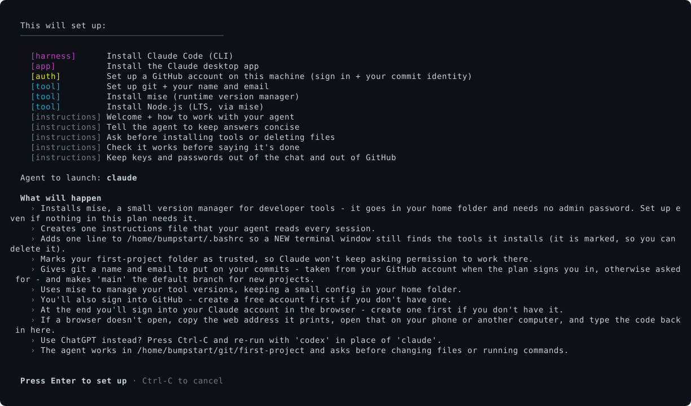

# bumpstart

## Set up your computer to build with AI

Bumpstart installs and connects the tools you need to build websites, small apps and
automations with Claude or ChatGPT.

You run one setup command. Bumpstart installs the tools for you, including Git and
Node.js. You do not need to install mise yourself or follow separate tool setup guides.

When setup finishes, Claude Code or Codex opens in your terminal, ready for your first
request. A terminal is an app where you type commands and messages to the coding agent.

Choose your computer: [Windows](#windows), [Mac](#macos) or [Linux](#linux).

## Before you start

For the setup below, have these accounts ready:

- a Claude or ChatGPT subscription, which you use to sign in to the coding agent
- a free GitHub account, which lets the agent save your work online

Bumpstart prompts you to sign in during setup. Having a GitHub account is enough;
bumpstart installs the GitHub tools for you.

## Quick start

Choose the instructions for your computer. Copy only the command for the subscription
you use.

### Windows

When Node.js or Git needs installing, Windows asks permission to install it for
everyone on the PC. Other app installers may also ask permission.

1. Press the Windows key, type "PowerShell" and open Windows PowerShell.
2. Copy one command below.

   If you pay for Claude:

   ```powershell
   & ([scriptblock]::Create((irm https://raw.githubusercontent.com/connorads/bumpstart/main/bumpstart.ps1))) claude starter
   ```

   If you pay for ChatGPT:

   ```powershell
   & ([scriptblock]::Create((irm https://raw.githubusercontent.com/connorads/bumpstart/main/bumpstart.ps1))) codex starter
   ```

3. Paste the command into PowerShell with Ctrl+V and press Enter.
4. Read the setup list. Press Enter to start installing. Keep the window open and
   follow any permission or sign-in prompts.
5. When prompted, press Enter to open the coding agent. Sign in, then send your
   [first message](#your-first-message).

### macOS

Setup may ask for your Mac login password. Nothing appears as you type the password;
press Enter when you have finished typing.

1. Press Command+Space, type "Terminal" and press Enter.
2. Copy one command below.

   If you pay for Claude:

   ```bash
   /bin/bash -c "$(curl -fsSL https://raw.githubusercontent.com/connorads/bumpstart/main/bumpstart)" _ claude starter
   ```

   If you pay for ChatGPT:

   ```bash
   /bin/bash -c "$(curl -fsSL https://raw.githubusercontent.com/connorads/bumpstart/main/bumpstart)" _ codex starter
   ```

3. Paste the command into Terminal with Command+V and press Enter.
4. Read the setup list. Press Enter to start installing. Keep the window open and
   follow any permission or sign-in prompts.
5. When prompted, press Enter to open the coding agent. Sign in, then send your
   [first message](#your-first-message).

### Linux

Setup may ask for your login password when installing system software.

1. Open your applications menu, search for "Terminal" and open it.
2. Copy one command below.

   If you pay for Claude:

   ```bash
   /bin/bash -c "$(curl -fsSL https://raw.githubusercontent.com/connorads/bumpstart/main/bumpstart 2>/dev/null || wget -qO- https://raw.githubusercontent.com/connorads/bumpstart/main/bumpstart)" _ claude starter
   ```

   If you pay for ChatGPT:

   ```bash
   /bin/bash -c "$(curl -fsSL https://raw.githubusercontent.com/connorads/bumpstart/main/bumpstart 2>/dev/null || wget -qO- https://raw.githubusercontent.com/connorads/bumpstart/main/bumpstart)" _ codex starter
   ```

3. Paste the command into Terminal using its right-click menu and press Enter.
4. Read the setup list. Press Enter to start installing. Keep the window open and
   follow any permission or sign-in prompts.
5. When prompted, press Enter to open the coding agent. Sign in, then send your
   [first message](#your-first-message).

## Your first message

You are ready when Claude Code or Codex is open in the terminal and waiting for your
message. The agent starts in a project folder called `first-project` inside `git` in
your home folder.

Bumpstart provides a starter message asking the agent to help you choose something to
build. Follow the on-screen instruction to paste it, then press Enter. If the message
could not be copied, open `first-message.txt` in the project folder and copy its text.
You can also type your own request, such as "Help me build a website for my football
league. Ask me one question at a time."

The standard setup also installs the Claude or ChatGPT desktop app where supported.
The coding agent opens in the terminal. A website saved as an app in your browser is
separate from the desktop app that bumpstart installs.

If setup reports a failed step, read the named error before continuing.



<details>
<summary>Advanced setup and technical details</summary>

## What happens when you run it

1. Fetch the repo at a pinned ref (default `main`) as a tarball, and run it locally.
2. **Resolve** the id list to a plan: expand presets and dependencies, dedupe, order by
   kind, pick the launch agent. Any bad id, cycle or missing agent fails **here**,
   before anything is installed.
3. Print the plan and ask **once** to proceed.
4. On Windows, persist the agent folders on your account's PATH before installing.
   Put the install substrate in place - Homebrew on macOS, mise on Linux - then apply
   each block. Check-then-act, so re-runs skip what is already there.
5. Assemble the block instructions into **one canonical file**, `~/.agents/AGENTS.md`,
   then point each installed agent's own path at it (`~/.claude/CLAUDE.md` for Claude,
   `~/.codex/AGENTS.md` for Codex) so both read the single source.
6. Make sure a new terminal window still finds what was installed. On macOS and Linux
   that is one marked line in your shell's startup file; on Windows it is your
   account's PATH in the registry.
7. Create a starter project at `~/git/first-project`, pre-trust it, copy a friendly
   first message to your clipboard, save that message as `first-message.txt` in the
   folder, and launch the agent. A browser opens for sign-in - that one prompt stays.

Everything is idempotent: run it again and the done steps are skipped. bumpstart never
scribbles in files you own - if the canonical file or a real agent config already
exists, it backs off and points you at it. Use `--force` to replace, which moves real
files to `.bak` first. The one exception is the PATH line in step 6, which is appended
and marked rather than merged into anything.

If any step fails, the ending says so and names what failed. "Setup complete." is only
ever printed when nothing warned.

### Preview it first

`--plan` prints the resolved plan and exits, changing nothing:

```bash
/bin/bash -c "$(curl -fsSL https://raw.githubusercontent.com/connorads/bumpstart/main/bumpstart)" _ claude starter --plan
```

### Removing it

The PATH edit is the only change bumpstart makes outside its own config paths.

On **macOS and Linux** it is a line in a file you own, wrapped in markers, so removing
it is mechanical. Delete these three lines from `~/.bashrc`, `~/.zshrc` or
`~/.config/fish/config.fish`:

```text
# >>> bumpstart >>>
export PATH="$HOME/.local/bin:$HOME/.codex/bin:${XDG_DATA_HOME:-$HOME/.local/share}/mise/shims:$PATH"
# <<< bumpstart <<<
```

On **Windows** it is your account's PATH, the per-user environment under
`HKCU\Environment`, because the CLI agents install into your home folder and their
installers persist nothing. A registry value has nowhere to put a comment marker, so
removal means deleting the two folders bumpstart added, by name:
`%USERPROFILE%\.local\bin` and `%USERPROFILE%\.codex\bin`. Search for "Edit environment
variables for your account", select each one under **Path**, and delete it. Anything
else on that PATH was put there by an installer, not by bumpstart.

Everything else lives under `~/.agents/`, `~/.claude*`, `~/.codex/`, `~/.local/` and
`~/git/first-project`.

### Linux compatibility

Tested on Ubuntu, Debian, Fedora and Arch, on x86-64 and arm64, and inside WSL 2 and
containers. Derivatives (Mint, Pop!\_OS, openSUSE, …) are found by capability, not by
name, so they generally work too.

Not supported: Alpine and other musl systems, because the tools we install publish no
musl builds; NixOS, because the vendor binaries need `/lib64`; and WSL 1, which
bumpstart refuses, printing the one command that upgrades it to WSL 2.

### What differs by platform

The shape is identical everywhere; only how things are acquired differs.

On **Linux** there is no Homebrew. The agents install with their vendors' own Linux
one-liners, which work out your CPU and libc themselves, and `gh`, Node and pnpm come
from mise, into your home folder, with no admin password. `git` is the one exception:
there is no portable way to install it in user space, so it comes from whichever system
package manager the machine has - `apt-get`, `dnf`, `pacman` or `zypper`, found by
asking, not by reading a distro name - and that is the one step that needs your
password. The Claude desktop app installs from Anthropic's apt repository on Debian and
Ubuntu, with its signing key's fingerprint checked before the repository is trusted.
The ChatGPT app and GitHub Desktop have no official Linux build, so those blocks simply
do not appear in the plan.

On **Windows** installs go through winget and the CLIs' own PowerShell installers.
Setup allows scripts in its own child process only. Permanent execution policy stays
unchanged, and managed execution-policy restrictions still apply.
Windows setup returns exit code 1 if a required step fails and leaves the agent closed.
A successful setup returns 0.
Instead of a symlink, each agent is linked to the canonical file its own way: Claude via
an `@import` line in `~/.claude/CLAUDE.md`, Codex via a physical copy of
`~/.codex/AGENTS.md`, because Codex has no import. PATH is persisted to your account's
environment rather than to a startup file: everything winget installs is put on PATH by
its own installer, but the CLI agents install into your home folder and persist nothing,
so bumpstart adds those two folders itself. The clipboard paste is Ctrl+V.

## Composing your own setup

Everything above is one preset. Underneath, bumpstart composes vetted **blocks**, and
you pick them by listing ids:

```bash
/bin/bash -c "$(curl -fsSL https://raw.githubusercontent.com/connorads/bumpstart/main/bumpstart)" _ claude github node concise
```

The `$(...)` form downloads the script first so your terminal stays the input. That is
needed because `gh auth login` and the agent CLIs are interactive, and `curl | bash`
would break those prompts. Homebrew uses the same trick. The `_ a b` after the paste
sets the block list; `_` is a throwaway `$0`.

Downloading needs either `curl` or `wget` - bumpstart uses whichever is there. macOS
always has curl. If a paste prints nothing at all you have neither: install one
(`sudo apt install curl`) and paste again.

With no ids at all you get `claude starter`, the same beginner setup:

```bash
/bin/bash -c "$(curl -fsSL https://raw.githubusercontent.com/connorads/bumpstart/main/install.sh)"
```

```powershell
irm https://raw.githubusercontent.com/connorads/bumpstart/main/bumpstart.ps1 | iex
```

### A setup without GitHub

`git` and `github` are separate ids. `git` gives you version control and asks for the
name and email to put on your commits; `github` adds the account, the sign-in, and the
`@users.noreply.github.com` address that keeps your real one off public commits.
`github` pulls `git` in, never the reverse:

```text
… _ claude git node concise    # no GitHub account needed, and none is asked for
```

That is the whole difference. Why it runs this way round, and what the prompted path
gives up: [docs/adr/0007](docs/adr/0007-git-and-github-are-separate-blocks.md).

### How ids compose

The list is **unioned** and dependencies are pulled in automatically, so there is no
removal operator: **every id only ever adds**. That rule shapes the vocabulary. Each id
names the smallest thing that is true, and a preset contains only what every user of it
wants.

The one single choice is which agent launches, and there **last in the list wins**:
`claude codex` launches Codex, `codex claude` launches Claude.

### Axes

Every block carries two labels. `kind` is for the applier: it decides when a block
runs. **`axis` is for you**: it names the question the block answers, and it is what
`--build` asks and `--list` groups by.

| axis | the question it asks |
| --- | --- |
| `recipe` | Start from a ready-made setup? |
| `agent` | Which agent should launch? |
| `tools` | What should we install? |
| `steering` | How should the agent be steered? |

A block with no axis is never offered on its own but is still pulled in as a
dependency. `mise` is the example: nobody picks a version manager directly, it arrives
with `node` or `pnpm`. Axes are data (`axes/<id>/meta`), so adding a question is adding
a directory.

### Atoms

| id | axis | kind | what it does |
| --- | --- | --- | --- |
| `claude-cli` | agent | harness | Install Claude Code (CLI); can be the launched agent |
| `codex-cli` | agent | harness | Install Codex (CLI); can be the launched agent |
| `git` | tools | tool | Install git and give it your name and email |
| `github` | tools | auth | Install the GitHub CLI, sign in, and take your commit identity from the account (pulls in `git`) |
| `github-desktop` | tools | app | Install GitHub Desktop, so you can see and undo what the agent did (pulls in `git`) |
| `node` | tools | tool | Install Node.js LTS via mise (pulls in `mise`) |
| `pnpm` | tools | tool | Install pnpm via mise (pulls in `mise`) |
| `safer-installs` | tools | tool | Make npm/pnpm/mise wait 4 days on brand-new releases (macOS + Linux) |
| `welcome` | steering | instructions | Greet the beginner, and how to work with the agent every session |
| `concise` | steering | instructions | Ask the agent to keep answers concise |
| `ask-first` | steering | instructions | Ask before installing tools or deleting files |
| `verify` | steering | instructions | Run it before calling it done; show the real error |
| `secrets` | steering | instructions | Keep keys out of the chat, and out of GitHub |
| `check-first` | steering | instructions | Read the code or the docs instead of answering from memory |
| `commit-often` | steering | instructions | Commit at every working checkpoint; never force-push |
| `follow-conventions` | steering | instructions | Match the codebase's conventions, not the agent's defaults |
| `remember` | steering | instructions | Write down decisions and surprises for the next reader |
| `claude-desktop` | - | app | Install the Claude desktop app (arrives with `claude`; Linux: Debian/Ubuntu only) |
| `codex-desktop` | - | app | Install the ChatGPT app, Codex's desktop home (arrives with `codex`; not on Linux) |
| `mise` | - | tool | Install mise, a runtime version manager (arrives with `node` or `pnpm`) |

`github` and `github-desktop` are different things: the first is the terminal's
account, the second is a GUI for reviewing and undoing changes. `github-desktop` is
opt-in, not part of `web` or `starter`, and it means a second GitHub sign-in - `gh` and
GitHub Desktop keep separate credential stores and neither can read the other's token.
That one happens whenever you first open the app, so it is off the paste's critical
path, and `--plan` says so.

### Presets, one per axis

A preset is just a block whose content is a list of other ids. Each of these covers
exactly one axis, so they compose: pick the one you want per axis. On a multi-select
axis you *may* pick more than one, but two steering presets is rarely what you want -
you would get both sets of habits.

| preset | axis | expands to |
| --- | --- | --- |
| `claude` | agent | `claude-cli claude-desktop` |
| `codex` | agent | `codex-cli codex-desktop` |
| `web` | tools | `github node` (and so `git`, `mise`) |
| `beginner` | steering | `welcome concise ask-first verify secrets` |
| `dev` | steering | `concise ask-first verify secrets check-first commit-often follow-conventions remember` |

`beginner` and `dev` are the two steering tiers. `dev` is the same safety habits plus
the ones that matter once you are writing real code - check before you recall, commit at
every checkpoint, match the codebase, write down what you learned - and deliberately
drops `welcome`, which exists to explain the basics:

```text
… _ claude web dev        # the stack, steered for someone who codes
```

### Recipes

A recipe spans axes: it is the ready-made setup a workshop hands out.

| recipe | axis | expands to |
| --- | --- | --- |
| `starter` | recipe | `web beginner` |

`starter` is deliberately **agent-free**. Which agent you want is not a tooling choice,
it is which subscription you already pay for, and a workshop handout cannot know that
for the room. So the agent is always a separate id:

```text
… _ claude starter        # everything Claude + stack + beginner habits (the default)
… _ codex starter         # the same on ChatGPT/Codex
… _ claude-cli starter    # CLI only, no desktop app
… _ claude codex starter  # both agents, launches codex (last in the list wins)
… _ codex web             # the stack without the beginner instructions
… _ claude starter github-desktop   # …plus a GUI for seeing and undoing changes
```

Appending an agent id to *any* preset sets the launcher: the launch scan runs over the
expanded list in input order, so `claude starter codex` installs both and launches
Codex. It adds, never replaces.

Desktop-ness is a composition choice too: `claude` (a bundle) gives CLI plus desktop
app, `claude-cli` gives CLI only. Same for `codex`. The launched agent is always the
CLI; the desktop app is an add-on.

A tool block also teaches the agent how to use what it installs. Its short guidance is
stacked into the canonical instructions file, but only when that block is in the plan -
so `mise`, `node` and `pnpm` steer the agent to those tools instead of a hand-rolled
installer, and the guidance is present exactly when the tool is.

The `skill` and `mcp` kinds are supported by the applier, but no recommended skill or
MCP block ships yet. Better none than a redundant one.

## Flags

| flag | effect |
| --- | --- |
| `--plan` | Print the resolved plan and exit - no changes |
| `--list` | Print the catalogue, grouped by axis, and exit |
| `--show <id>` | Print one block's detail (axis, kind, deps, target) |
| `--build` | Interactive wizard - one question per axis, emit the paste |
| `--yes` / `-y` | Skip the confirm, and every other question (for headless and VM runs) |
| `--force` | Rewrite an existing canonical file; back real agent configs up to `.bak` then link |
| `--no-launch` | Don't drop into the agent at the end |

## Handing out a paste (workshop leaders)

Whoever hands out the paste can discover and assemble it in the CLI rather than
recalling ids from the tables above.

```bash
/bin/bash -c "$(curl -fsSL https://raw.githubusercontent.com/connorads/bumpstart/main/bumpstart)" _ --list       # what blocks exist
/bin/bash -c "$(curl -fsSL https://raw.githubusercontent.com/connorads/bumpstart/main/bumpstart)" _ --show node  # one block's detail
/bin/bash -c "$(curl -fsSL https://raw.githubusercontent.com/connorads/bumpstart/main/bumpstart)" _ --build      # wizard
```

`--build` asks **one question per axis**, in the order the axes declare: start from a
recipe, which agent launches (required, pick a number), what to install, how to steer.
Each row shows what it pulls in, so a whole and its parts read as nested rather than as
separate ticks. Answering "starter" then "claude" emits `claude starter`, the same
string the Quick start hands out. It previews the resolved plan, then **prints the
one-paste command** to hand out, copies it to the clipboard where `pbcopy` exists, and
offers to run the setup now.

### Pinning

An unpinned run uses `main`. For a reproducible workshop, pin the whole repo to a commit
SHA with `BUMP_REF` - vetted source is the audit layer:

```bash
BUMP_REF=<sha> /bin/bash -c "$(curl -fsSL https://raw.githubusercontent.com/connorads/bumpstart/main/bumpstart)" _ claude starter
```

The emitted `--build` command inherits the run's `BUMP_REF`, so pinning the run pins the
paste it prints. Vendor CLI versions - Claude, Codex, mise and the rest - sit outside
the pin: they always install the latest.

## Notes

- The CLI is the stable spine; the desktop app is a fast-moving vendor layer, so a
  failed cask install warns and continues rather than aborting.
- Codex's desktop experience lives inside the ChatGPT app
  (`brew install --cask chatgpt`) since the July 2026 Codex/ChatGPT merge.
- Instructions live in one canonical file, `~/.agents/AGENTS.md`, and each agent's own
  path is a symlink to it - the documented `ln -s AGENTS.md CLAUDE.md` pattern - so
  editing one file steers every agent and every session. `~/.agents/` is the one agents
  root: it is already where Codex, Amp, opencode and pi look for user-scope skills. No
  standard names a user-level `AGENTS.md` yet; [agents.md](https://agents.md) is
  repo-scoped.
- **Set up before this moved?** Earlier versions wrote the canonical file to
  `~/.config/agents/AGENTS.md`. A re-run writes the new path but will **not** relink:
  `~/.claude/CLAUDE.md` still points at the old file, so bumpstart sees a foreign symlink
  and backs off, and your agent keeps reading the old file. Move your edits into
  `~/.agents/AGENTS.md`, delete the old file, and re-run - or re-run with `--force`,
  which backs the old links up to `.bak` and relinks.

## Decisions

- Why `kind` and `axis` are separate labels, and what was rejected on the way:
  [0001](docs/adr/0001-axis-as-the-human-taxonomy.md).
- How Linux is supported without a distro table anywhere, and what was rejected -
  distro-family cells, Homebrew on Linux, Nix, machine profiles:
  [0002](docs/adr/0002-linux-support.md).
- Why real installs run on pristine machines, and the three exit classes:
  [0003](docs/adr/0003-real-installs-on-pristine-machines.md).
- Why the Windows lane is hand-rolled in the workflow rather than a row in the lane
  matrix: [0004](docs/adr/0004-the-windows-lane-is-not-a-row.md).
- Why the Windows PATH edit is a registry value rather than a startup-file line, and
  what that costs at removal time: [0005](docs/adr/0005-windows-persists-path-too.md).
- Why the project is called bumpstart:
  [0006](docs/adr/0006-the-project-is-called-bumpstart.md).
- Why `git` and `github` are separate blocks, and the privacy the prompted path gives
  up: [0007](docs/adr/0007-git-and-github-are-separate-blocks.md).

</details>

## Contributing

[](https://github.com/connorads/bumpstart/actions/workflows/ci.yml)

[](LICENSE)

Two spines, one shared fixture contract, and a set of lanes that really install on
machines that have never seen bumpstart. See [CONTRIBUTING.md](CONTRIBUTING.md).

## Licence

[MIT](LICENSE).
